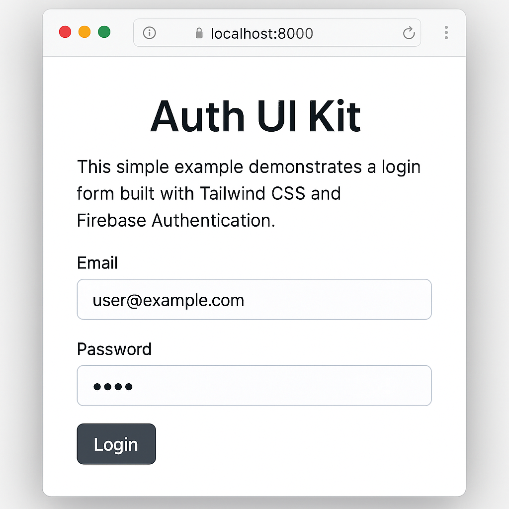

# gpt-fusion
<!-- Plan:
1. Document marketing site integration.
2. Mention PyPI installation for the new alpha release.
3. Update coverage badge to Codecov.
4. Add note about Algolia DocSearch for docs search.
-->
[](https://github.com/costasford/gpt-fusion/actions/workflows/ci.yml)
[](https://codecov.io/gh/costasford/gpt-fusion)
[](https://www.python.org/)
[](LICENSE)
[](https://pypi.org/project/gpt-fusion/)
[](https://pypi.org/project/gpt-fusion/)

"Practical demos of human-AI collaboration"

GPT Fusion is a small sandbox for developers curious about mixing traditional
programming with AI assistance. It bundles CSV analysis utilities, a sample
FastAPI backend, web scraping helpers and demo apps like a Firebase auth UI and
a Unity prototype. The project targets tinkerers who want clear examples of how
humans and ChatGPT can iteratively build software together.

## Features

- Python utilities for math and CSV summaries
- Simple web scraper and text helpers
- Optional FastAPI backend and Twitter bot modules
- Demo front-end with Firebase authentication
- Unity project showcasing basic movement scripts

## Installation & Usage

You can install the alpha release directly from PyPI:

```bash
pip install gpt-fusion
```

To hack on the project locally, clone the repo and install the development
dependencies:

```bash
git clone https://github.com/costasford/gpt-fusion.git
cd gpt-fusion
pip install -r requirements-dev.txt
```

The optional packages in `requirements-dev.txt` (such as FastAPI and Tweepy)
are required for some of the tests. Make sure to install them before running
the full suite:

```bash
pip install -r requirements-dev.txt
```

Run the test suite to confirm everything works:

```bash
pytest
```

Try the example script which loads numbers from `data/numbers.csv`:

```bash
python examples/tutorial.py
```

You can also preview the auth UI demo by serving the `auth-ui-kit` folder:

```bash
python -m http.server --directory auth-ui-kit
```



_Tip: convert screenshots to WebP for a smaller footprint._

## Starter kit templates

Use the cookie-cutter helpers to spin up small demos:

```bash
python -m gpt_fusion.starter_kits create_csv_app my-csv-demo
python -m gpt_fusion.starter_kits create_tailwind_ui my-ui-demo
```

Each command copies a minimal project into the given folder so you can start
your own AI adventure right away.

## Project layout

```
src/            # Python package source
  gpt_fusion/   # package implementation
    core.py     # greeting helper
    utils.py    # math helpers and chat history container
    analysis.py # simple CSV helpers

tests/          # pytest-based unit tests
docs/           # documentation with examples and tutorials
data/           # sample data
```

## Documentation

Detailed guides live in [`docs/`](docs). Build the site locally with

```bash
cd docs
jekyll serve
```

and open <http://localhost:4000> to browse the tutorials.
The production build uses `jekyll-minifier` to shrink CSS, JS and HTML files
before deploying to GitHub Pages.
The marketing landing page is available at `docs/marketing-site/index.html` and is built alongside the documentation.
The docs are indexed by [Algolia DocSearch](https://docsearch.algolia.com/), providing instant search across all pages.

## Local workflow automation

Run the helper script to replicate the CI checks locally:

```bash
python scripts/run_checks.py
```

The script formats the code, runs the tests, and builds the documentation.
## CI & Coverage

Our GitHub Actions workflow uploads test coverage to [Codecov](https://codecov.io/gh/costasford/gpt-fusion). The badge above shows the latest percentage.


## Releases

The `main` branch is protected so changes only merge after the CI workflow
passes. Versions follow [Semantic Versioning](https://semver.org) and release
notes are generated automatically using
[Release Drafter](https://github.com/marketplace/release-drafter).

## Contributing

Development guidelines are recorded in [AGENTS.md](AGENTS.md).
Please open issues and pull requests via GitHub.

## Repository topics and labels

To help others discover this project, tag the repository with relevant topics
such as `ai`, `tailwindcss`, `pytest` and `unity3d`.  Issues should use
standard labels like `bug`, `enhancement` and `help wanted` so contributors can
quickly triage requests.

## License & Contact

This project is licensed under the [MIT License](LICENSE).
For questions or support, open an issue or reach the maintainer at
[costasford@yahoo.com](mailto:costasford@yahoo.com).

